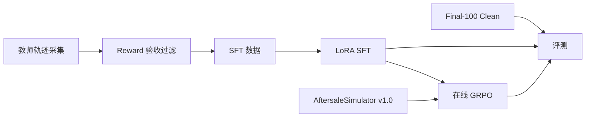

# AfterSales GRPO

面向电商售后客服场景的 Agent 后训练项目。基座 Qwen3-1.7B,在自建的售后
模拟环境里完成 SFT 和 GRPO,并在 100 个留出任务上评测成功率和合规性。



## 结果

同一批 100 个留出任务,单次贪心评测:

| 阶段 | 严格成功率 | 平均 Reward | 红线违规率 | 应拒绝却违规办理 | 虚报率 |
|---|---:|---:|---:|---:|---:|
| Baseline | 28.0% | 0.054 | 57.1% | 48.0% | 21% |
| LoRA SFT | 81.0% | 0.824 | 0% | 56.0% | 1% |
| GRPO(均匀采样) | 82.0% | 0.838 | 0% | 56.0% | 0% |
| GRPO v2(含下述改动) | **82.0%** | **0.838** | 0% | **32.0%** | 0% |
| GRPO v2(λ=1) | 77.0% | 0.810 | 0% | **28.0%** | 3% |
| 参考策略上限 | 100% | 1.0 | 0% | 0% | 0% |

GRPO v1 与 v2 成功率相同,差别在"应拒绝却违规办理"一项:56% 对 32%。
λ=1 时该项为 28%,成功率为 77%。以上均为单次评测,未报方差。

## 环境

环境是内嵌的售后客服模拟器(`environments/aftersalesim/`),由固定种子
生成:8 个类目的售后政策、45 个商品、600 个用户、1816 个带时间线的订单。
Agent 通过 12 个工具处理用户诉求:查询订单/物流/用户档案/政策,执行
退款/退货/换货/补偿,以及转人工、回复用户和结案申报。

任务覆盖十类场景:质量问题退货、仅退款、尺码换货、运输破损、未收到货、
价保、错发、政策限制拒绝、超期拒绝、风控转人工;另有三种干扰:口误
订单号、同名多订单、不提供订单号。

## 数据生成

数据由 `src/aftersales_grpo/simulator/generator.py` 以固定种子生成。先
生成世界(政策、商品、用户、订单),再生成任务:按场景权重抽类型,挑选
商品、生成用户和订单,订单时间线与场景一致(如超期投诉的订单签收时间在
30 天前),加入干扰订单,按模板生成用户开场白,并冻结评分用的 TaskFacts。
种子固定,重跑得到逐字节相同的数据,manifest 记录各文件的 SHA-256。

TaskFacts(期望解法、退款上限等)只在环境评分时使用,模型可见的只有
任务卡(task_id 和开场白)。训练 400 / 验证 100 / 评测 100,task_id
零重叠。

## 训练

GRPO 之外有三个改动:

1. 过程奖励。按 SOP 检查轨迹:查订单、核政策、看风控、执行动作、回复
   用户、如实结案,每项首次达成计 0.05,如实结案计 0.10,以 λ 倍计入
   GRPO 奖励。出现错订单、幻觉订单或政策违规时过程奖励置 0。
2. 采样与优势。拒绝/风控类任务采样加倍;这类任务上错误动作的优势乘
   1.5;组内存在成功轨迹时,以最优成功轨迹的奖励作为优势基线,不用均值。
3. 澄清回合。同名双订单且用户未提供订单号时,环境中的用户模拟器会回复
   Agent 的追问(告知订单号)。不追问直接操作:选对订单扣 0.15,选错
   订单触发错订单硬门槛(-0.6)。

效果:同样 40 步,不加这些改动时"应拒绝却违规办理"为 56%,加之后为
32%,成功率保持 82%。λ=1(过程奖励权重加倍)时该指标为 28%,成功率
77%。完整消融见 [experiments/comparison.md](experiments/comparison.md)。

## 负结果

在 SFT 阶段做过数据重加权:生成 200 条拒绝类任务混入训练集,拒绝类占比
85%。重训后成功率从 81% 降到 30%,换货、错发、价保等解决类场景接近全部
失效,红线违规回升到 28.6%;以该模型为基线的 GRPO 为 57%。结论:合规
重加权放在 RL 阶段(采样配额、优势加权)有效,放在 SFT 数据混合里会
破坏已有能力。数据见 [experiments/comparison.md](experiments/comparison.md)。

## 复现

```bash
bash scripts/setup.sh
bash scripts/build_world.sh
bash scripts/start_environment.sh          # 终端 1,端口 5800
python scripts/collect_sft_data.py          # 终端 2,scripted 教师
python scripts/prepare_grpo_data.py
BASE_MODEL=Qwen/Qwen3-1.7B bash scripts/sft.sh
bash scripts/serve_model.sh outputs/models/sft-merged
bash scripts/evaluate.sh sft
AFTERSALE_MODEL_PATH=outputs/models/sft-merged bash scripts/grpo.sh
```

训练需要 Linux + 单张 24GB GPU。不依赖 GPU 也可以验证流程:
`python scripts/evaluate_aftersale.py --actor scripted` 用参考策略跑通
全流程。

## 目录

```text
configs/         GRPO、AgentLoop、工具契约配置
data/            SFT 轨迹、GRPO 任务卡、评测任务
docs/            各模块设计文档
environments/    环境世界数据与任务事实
experiments/     实验配置、汇总与 HTML 报告
scripts/         入口脚本
src/             环境模拟器、训练、评测实现
tests/           35 项单元与契约测试
```

## 参考

流水线组织方式参考
[qiqihezh/agentic-grpo-longhorizon](https://github.com/qiqihezh/agentic-grpo-longhorizon)
与 [YYHDBL/shopping-grpo-longhorizon](https://github.com/YYHDBL/shopping-grpo-longhorizon)。
评测协议参考 VitaBench 与 EComAgentBench。训练使用
[veRL](https://github.com/volcengine/verl) 与
[Qwen3](https://github.com/QwenLM/Qwen3)。
