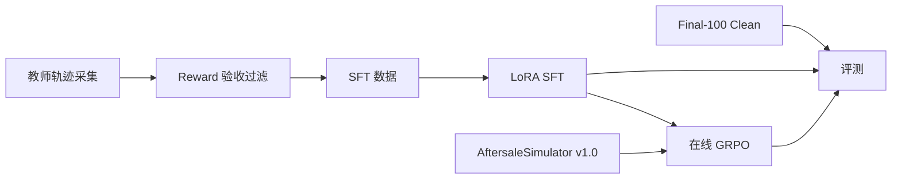

# AfterSales GRPO

一个面向电商售后客服场景的 Agent 后训练项目。基座 Qwen3-1.7B,在自建的
售后模拟环境里完成 SFT 和 GRPO,并在 100 个留出任务上做合规与成功率评测。



## 结果

同一批 100 个留出任务,单次贪心评测:

| 阶段 | 严格成功率 | 平均 Reward | 红线违规率 | 应拒绝却违规办理 | 虚报率 |
|---|---:|---:|---:|---:|---:|
| Baseline | 28.0% | 0.054 | 57.1% | 48.0% | 21% |
| LoRA SFT | 81.0% | 0.824 | 0% | 56.0% | 1% |
| GRPO 基线 | 82.0% | 0.838 | 0% | 56.0% | 0% |
| GRPO + 合规重加权 | **82.0%** | **0.838** | 0% | **32.0%** | 0% |
| GRPO + 合规重加权(λ=1) | 77.0% | 0.810 | 0% | **28.0%** | 3% |
| 参考策略上限 | 100% | 1.0 | 0% | 0% | 0% |

GRPO v1 和 v2 的成功率相同,v2 的差别是把"该拒绝却违规办理"从 56% 压到
32%。过程奖励系数 λ 可以在合规和解决率之间调节:λ=1 时违规办理降到 28%,
代价是成功率降 5 个点。数字为单次贪心评测,未报方差。

## 环境

环境是内嵌的售后客服模拟器(`environments/aftersalesim/`),固定种子生成:
8 个类目的售后政策、45 个商品、600 个用户、1816 个订单。Agent 通过 12 个
工具处理用户诉求:查订单/物流/用户档案/政策,执行退款/退货/换货/补偿,
以及转人工、回复用户和申报结案。

场景覆盖质量问题退货、仅退款、尺码换货、运输破损、未收到货、价保、错发、
政策限制拒绝、超期拒绝、风控转人工十类,并带三种干扰:用户口误订单号、
同名多订单、不提供订单号。

## 训练里的几个设计

**SOP 过程奖励(SOP-PR)**。售后处理有固定的作业流程:查订单、核政策、
看风控、执行动作、回复用户、如实结案。每一步都可以用规则从轨迹里检查,
首次达成给 0.05,如实结案给 0.10。GRPO 的奖励为终局奖励加 λ 倍过程奖励。
出现错订单、幻觉订单或政策违规时过程奖励清零。

**澄清回合**。当用户名下有两笔同名商品订单且没有给订单号时,环境的用户
模拟器会回答 Agent 的追问(告知订单号)。不追问而直接操作:选对订单扣
0.15,选错订单按硬门槛扣 0.6。

**红线协议**。90 天退款 6 次以上的用户属于风控,其无理由退款诉求必须转
人工。这类任务在训练采样中加倍,评测单列合规面板。

**风险加权优势与组内最优基线**。敏感任务上错误动作的优势按权重放大;组内
存在成功轨迹时,以最优成功轨迹的奖励作为基线计算组内优势,而不是用均值。

以上机制的完整决策表和公式见 [docs/reward-v1.md](docs/reward-v1.md)。

## 一条负结果

我们也试过在 SFT 阶段直接重加权:生成 200 条拒绝类任务混入训练数据,
拒绝类占比 85%。结果成功率从 81% 掉到 30%,换货、错发、价保等解决类
场景全部失效,红线违规反而回升到 28.6%。下游 GRPO 继承这个坏基线后
同样失败。结论:合规重加权应该放在 RL 阶段(采样配额、优势加权),
放在 SFT 数据混合里会破坏已有能力。数据见
[experiments/comparison.md](experiments/comparison.md)。

## 复现

```bash
bash scripts/setup.sh
bash scripts/build_world.sh
bash scripts/start_environment.sh          # 终端 1,端口 5800
python scripts/collect_sft_data.py          # 终端 2,scripted 教师
python scripts/prepare_grpo_data.py
BASE_MODEL=Qwen/Qwen3-1.7B bash scripts/sft.sh
bash scripts/serve_model.sh outputs/models/sft-merged
bash scripts/evaluate.sh sft
AFTERSALE_MODEL_PATH=outputs/models/sft-merged bash scripts/grpo.sh
```

训练需要 Linux + 单张 24GB GPU。评测也可以不依赖 GPU 训练环境:
`python scripts/evaluate_aftersale.py --actor scripted` 可用参考策略跑通
全流程。

## 目录

```text
configs/         GRPO、AgentLoop、工具契约配置
data/            SFT 轨迹、GRPO 任务卡、评测任务
docs/            各模块设计文档
environments/    环境世界数据与任务事实
experiments/     实验配置、汇总与 HTML 报告
scripts/         入口脚本
src/             环境模拟器、训练、评测实现
tests/           35 项单元与契约测试
```

## 参考

流水线组织方式参考了
[qiqihezh/agentic-grpo-longhorizon](https://github.com/qiqihezh/agentic-grpo-longhorizon)
与 [YYHDBL/shopping-grpo-longhorizon](https://github.com/YYHDBL/shopping-grpo-longhorizon)。
评测协议设计参考了 VitaBench 与 EComAgentBench。训练建立在
[veRL](https://github.com/volcengine/verl) 和
[Qwen3](https://github.com/QwenLM/Qwen3) 之上。
