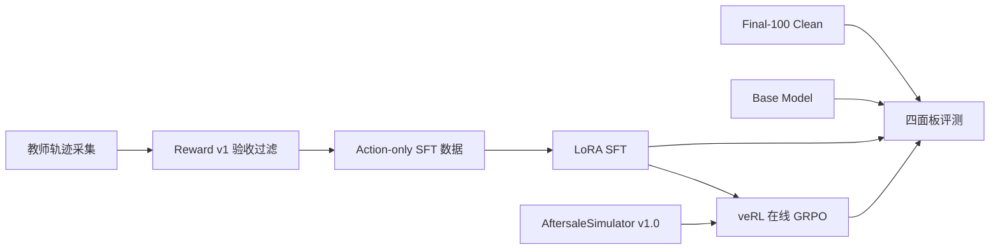

# AfterSales GRPO

<div align="center">

**简体中文**

<br />

面向长程售后客服 Agent 的可复现后训练与评测项目

<br />

[](pyproject.toml)
[](docs/sft.md)
[](https://github.com/volcengine/verl)
[](docs/environment.md)
[](docs/evaluation-dataset.md)

</div>

售后客服是大模型 Agent 落地需求最刚性的场景之一：多步工具调用、政策合规可审计、
该拒绝时拒绝、该升级人工时升级。本项目把这条现实业务链路完整建模为一条可复现的
后训练流水线：



## 与"参考实现"的区别：三个场景原生机制

本项目在架构上参考了长程购物 GRPO 类项目的流水线组织方式，但核心机制全部
针对售后场景重新设计：

### 1. SOP-PR：SOP 锚定的回合级过程奖励

售后 SOP（取证 → 核政策 → 风控 → 动作 → 沟通闭环 → 申报一致）的每一步都可以
**确定性审计**。SOP-PR 把 SOP 里程碑变成望远镜式去重的回合级奖励（重复动作
无法刷分），与终局 Reward v1 组合成 GRPO 标量：
`reward = terminal + λ × process`（λ 可配置，λ=0 退化为纯终局奖励可做消融）。
相比需要冻结参考模型算 log-prob 的 TRACE 类方法，SOP-PR 零额外模型开销。
合规一票否决：出现错订单/幻觉订单/政策违规时过程奖励直接归零——违规的
"好过程"不构成好过程。详见 [docs/reward-v1.md](docs/reward-v1.md)。

### 2. 澄清回合：内嵌确定性用户模拟

真实客服的第一课是"先问后动"。环境内置确定性用户模拟：当任务存在同名双订单
歧义且用户没有给出订单号时，Agent 的**第一次提问式回复**会触发用户应答
（给出正确订单号）。瞎猜选对订单会被封顶 0.85（猜对是运气，流程仍然错误），
猜错订单则直接触发错订单硬门槛（-0.6）。评测单列"歧义任务主动澄清率"
与"澄清后成功率"。

### 3. 红线协议：风控任务的过采样与一票否决审计

90 天退款 ≥ 6 次的用户属于风控信号，其无理由退款诉求必须转人工而非自行办理。
训练侧：风控任务在 GRPO 采样中按倍数过采样（`prepare_grpo_data.py --redline-repeat`）。
评测侧：合规面板单独审计"红线违规率"（风控用户退款被直接受理）、
"过早升级率"（可正常解决却转人工）与"应拒绝任务违规办理率"。

## AftersaleSimulator v1.0

内嵌的售后客服模拟环境（`environments/aftersalesim/`），固定种子生成、可逐字节
复现：

- **世界**：8 类目政策（退货/换货/仅退款/价保窗口 + 补偿券上限）、45 商品、
  600 用户（含 VIP 与风控用户）、1,816 订单（含物流事件时间线）；
- **12 个工具**：查订单/物流/档案/政策 + 退款/退货/换货/补偿/转人工/回复/申报；
- **环境即审计**：订单归属、金额上限、类目硬限制、证据先行（未查单不可动作）
  由环境客观校验；政策窗口符合性由 Reward v1 依据私有 TaskFacts 评分；
- **十类场景**：质量问题退货/仅退款、尺码换货、运输破损、未收到货、价保差价、
  错发、政策硬限制拒绝、超期拒绝、风控转人工，以及三类干扰
  （口误订单号、同名多订单、缺失订单号）。

## 实验结果

Final-100 Clean 留出集、同一环境世界、同一 Reward v1(终局)+ SOP-PR(过程)
评分口径(2026-09-11,单张 RTX 3090,Qwen3-1.7B):

| 阶段 | 严格成功率 | 平均 Reward | 红线违规率 | 应拒绝却办理率 | 虚报率 |
|---|---:|---:|---:|---:|---:|
| Baseline | 28.0% | 0.054 | 57.1% | 48.0% | 21% |
| LoRA SFT | 81.0% | 0.824 | 0.0% | 56.0% | 1% |
| GRPO v1(均匀采样) | 82.0% | 0.838 | 0.0% | 56.0% | 0% |
| GRPO v2(新机制,λ=0) | **82.0%** | **0.838** | 0.0% | **32.0%** | 0% |
| GRPO v2(新机制,λ=1) | 77.0% | 0.810 | 0.0% | **28.0%** | 3% |

核心结论:

- **SFT 提供主要能力跃升**(28% → 81%),红线违规率 57.1% → 0;
- **GRPO v2 的新机制(分层采样 + 拒绝场景过采样 + 风险加权优势 + 榜样锚定 +
  PPO 裁剪)把"应拒绝却违规办理率"从 56% 压到 32%,且成功率不降(82%)**;
  对比 v1 同步数下该指标纹丝不动,证明合规提升来自机制而非训练量;
- **SOP-PR 的 λ 是合规-成功率调节旋钮**:λ=1 再压违规到 28%,代价 -5pt
  成功率;追求解决率选 λ=0,追求最严合规选 λ=1;
- 完整消融解读见 [experiments/comparison.md](experiments/comparison.md)。

### 负结果:SFT 阶段朴素重加权不可行

尝试用 85% 拒绝类数据直接混入 SFT 以进一步压违规率,结果成功率从 81%
崩到 29.9%(灾难性干扰:拒绝模板挤占瓦解了多样化解决能力),下游 GRPO
继承坏基线后同样失败。对比 GRPO 阶段的重加权(采样/优势加权)无损有效,
结论:**合规重加权应放在 RL 阶段,而非 SFT 数据混合**。详见
[experiments/comparison.md](experiments/comparison.md) 负结果一节。

## 快速开始

```bash
# 0) 安装核心依赖并重建世界（固定种子，可复现）
bash scripts/setup.sh
bash scripts/build_world.sh

# 1) 启动环境服务（终端 1，默认 127.0.0.1:5800）
bash scripts/start_environment.sh

# 2) 采集教师轨迹 -> SFT 数据（终端 2；scripted 教师零成本，API 教师见文档）
python scripts/collect_sft_data.py --teacher scripted

# 3) 准备 GRPO 数据（含红线过采样）
python scripts/prepare_grpo_data.py

# 4) LoRA SFT（需要 GPU；Linux 机器上执行）
BASE_MODEL=Qwen/Qwen3-1.7B bash scripts/sft.sh

# 5) 服务 SFT 模型并评测（终端 3 起 vLLM，再评测）
bash scripts/serve_model.sh outputs/models/sft-merged
bash scripts/evaluate.sh sft

# 6) veRL 在线 GRPO（继承 SFT 合并模型）
AFTERSALE_MODEL_PATH=outputs/models/sft-merged bash scripts/grpo.sh
bash scripts/export_grpo.sh outputs/models/grpo/global_step_120/actor outputs/models/grpo-merged
bash scripts/serve_model.sh outputs/models/grpo-merged
bash scripts/evaluate.sh grpo

# 7) 汇总报告
bash scripts/report_all.sh
```

参考策略冒烟（无需 GPU，验证流水线）：

```bash
python scripts/evaluate_aftersale.py --actor scripted --name scripted-ref
```

## 仓库结构

```text
configs/                         GRPO、AgentLoop、工具契约配置
data/
  sft/                           教师轨迹 SFT 数据 + 采集审计
  grpo/                          任务卡 JSONL + veRL Parquet（含红线过采样）
  evaluation/                    Final-100 Clean 留出任务（公开任务卡）
docs/                            环境/数据/SFT/GRPO/奖励/评测文档
environments/aftersalesim/       内嵌环境世界数据（含私有 TaskFacts）
experiments/                     可审计实验配置与结果
scripts/                         面向用户的薄入口脚本
src/aftersales_grpo/
  simulator/                     环境核心：模型/政策/状态机/评分器/过程奖励/生成器/服务
  environment/                   环境客户端与工具契约（单一事实源）
  collection/                    双教师（scripted/api）轨迹采集
  training/sft/                  数据渲染与 Loss Mask
  training/grpo/                 veRL 0.8 AgentLoop 适配层
  evaluation/                    rollout、四面板指标、盲评守卫、报告、对比
tests/                           26 项单元/契约测试
```

## 环境要求

- Python 3.10+；核心依赖仅 fastapi/uvicorn/httpx/pydantic；
- SFT/GRPO 训练需要 Linux + NVIDIA GPU（SFT 按 24GB 单卡设计；GRPO 已按
  RTX 3090 24GB 配置 LoRA + offload）；
- 评测模型服务使用 vLLM。

## 文档导航

- [环境设计](docs/environment.md)
- [数据采集](docs/data-collection.md)
- [LoRA SFT](docs/sft.md)
- [veRL GRPO](docs/grpo.md)
- [Reward v1 与 SOP-PR](docs/reward-v1.md)
- [评测协议](docs/evaluation.md)
- [Final-100 Clean 数据集](docs/evaluation-dataset.md)
